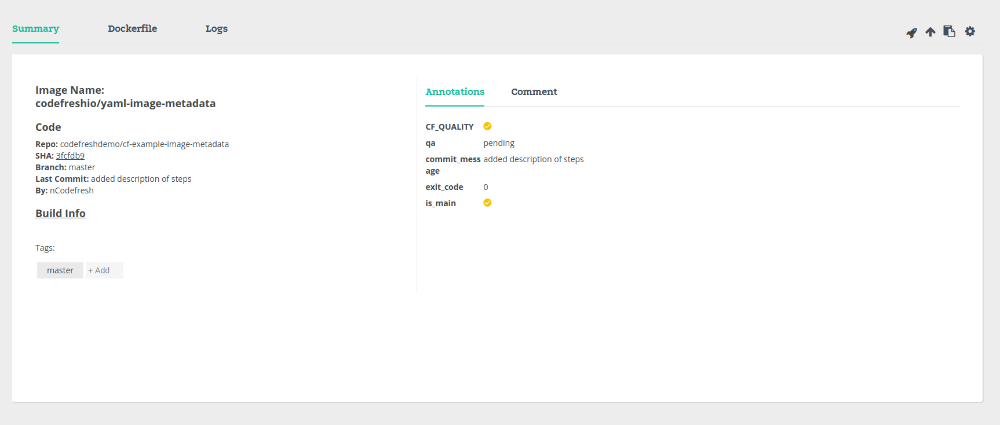

# cf-example-image-metadata


[]( https://g.codefresh.io/repositories/codefreshdemo/cf-example-image-metadata/builds?filter=trigger:build;branch:master;service:588070a7663ea90100aedb92~cf-example-image-metadata)

## Image Metadata Annotations
Images built by Codefresh may be annotated with an array of key-value metadata.
Metadata values may be:

#### 1. Strings.
#### 2. Numbers.
#### 3. Booleans.
#### 4. Expression evaluations.

## Build Phase Image Metadata Annotation
You may annotate an image as part of its build process by declaring on the Build step:

#### 1. The metadata attribute
#### 2. The set operation.
#### 3. An array of key-value metadata.

```yml
build_step:
  type: build
  ...
  metadata: # Declare the metadata attribute
    set: # Specify the set operation
      - qa: pending
      - commit_message: ${{CF_COMMIT_MESSAGE}}
      - exit_code: 0
      - is_main:
          evaluate: "'${{CF_BRANCH}}' == 'main'"
```

## Post-step Image Metadata Annotation
Any step in the workflow YAML may annotate built images in the way of Post-Step Operations.
To annotate a built image, configure any step with:

#### 1. The post-step operation.
#### 2. The metadata attribute.
#### 3. The set operation.
#### 4. A list of target images with the variable syntax of ${{build_step_name.imageId}}.
#### 5. An array of key-value metadata.

```yml
build_step:
  type: build
  ...

any_step:
  ...
  on_success: # Execute only once the step succeeded
    metadata: # Declare the metadata attribute
      set: # Specify the set operation
        - ${{build_step.imageId}}: # Select any number of target images
          - qa: pending
          - CF_QUALITY: true

  on_fail: # Execute only once the step failed
    metadata: # Declare the metadata attribute
      set: # Specify the set operation
        - ${{build_step.imageId}}: # Select any number of target images
          - exit_code: 1
          - CF_QUALITY: false

  on_finish: # Execute in any case
    metadata: # Declare the metadata attribute
      set: # Specify the set operation
        - ${{build_step.imageId}}: # Select any number of target images
          - is_main:
            evaluate: "'${{CF_BRANCH}}' == 'main'"
```

## Viewing Image Metadata Annotations
You can view an image's metadata annotation by browsing to:
#### 1. The Images view.
#### 2. Selecting the target image.
#### 3. Selecting the Annotations tab.

